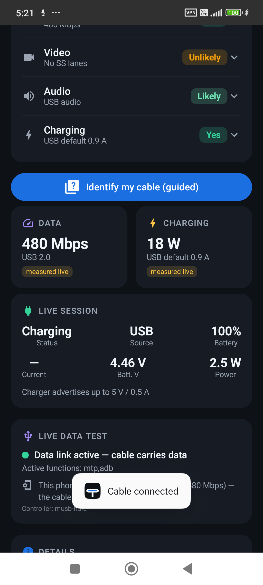

# What USB-C?

Tells you what a USB-C cable, port or connection can actually do — its **data
speed**, **charging**, **video** and **audio** capability — with honest
confidence labels about how each fact was determined.

Two apps in this repo:

| App | Path | Highlights |
|-----|------|-----------|
| **Android** | `app/` | Live data test, 5-axis verdict, guided wizard, interactive connector graphic, port-capacity readout |
| **Desktop (Linux)** | `desktop/` | Reads the **actual cable eMarker** from `/sys/class/typec/`, USB device link speeds, GTK GUI + CLI |

The desktop app can do what phones can't: on Linux the Type-C class is
world-readable, so it decodes the cable's electronic identity directly. See
[`desktop/README.md`](desktop/README.md).

---

## Android app

An Android app that tells you what a plugged-in USB-C cable can do — its **data
speed** and **charging capability** — drawn with a live USB-C connector graphic
and explained with honest confidence labels.

Inspired by the iOS "WhatUSBC" app, but going further: where the cable can be
read electronically (eMarker / kernel PD state), this app reads it. Where it
can't (the common case), it says so plainly and offers a cable-model database.



## What it shows

The hero feature is **"What this cable can do"** — a five-axis verdict that
answers the real question you have when holding a cable:

| Axis | Example verdict |
|------|-----------------|
| **Data** | Yes — USB 3.2 Gen 2 |
| **Speed** | 10 Gbps |
| **Video** | Likely (DP Alt Mode) / Confirmed |
| **Audio** | Yes (USB + DisplayPort) |
| **Charging** | Yes — up to 100 W |

Each axis is tappable for a plain-English explanation and a confidence label.

Supporting features:
- **Interactive connector graphic** — the 24-pin USB-C layout lights up the pin
  groups in use (power, CC/PD, USB 2.0, SuperSpeed, SBU). **Tap any pin group**
  to learn what it does and what it tells you about the cable.
- **Guided identification wizard** — because a phone *cannot* electrically probe
  a cable's pins, the wizard asks what you can see (speed markings like "SS"/"10"/
  "40", brand logos, whether video has ever worked, what it came with) and infers
  the capabilities. This is the honest way to fill the gap.
- **DATA / CHARGING** quick cards, **LIVE SESSION** (real-time current/voltage/
  watts), and a **DETAILS** panel (protocol, eMarker, construction, partner).
- **Confidence chips** on every fact: `from eMarker`, `from system`,
  `measured live`, `inferred`, `from database` — the app never fakes certainty.
- **Cable database picker** — identify by model as an alternative fallback.

## How it works — 3-tier detection

| Tier | Source | Needs |
|------|--------|-------|
| 1 | `BatteryManager` (always on) | nothing |
| 2 | sysfs (`/sys/class/typec`, `power_supply/usb`) via **Shizuku** | Shizuku app |
| 3 | same sysfs via **root** | root |

The deeper tiers reveal the negotiated PD contract and — when the kernel exposes
it — the cable's **eMarker** capabilities. See **[docs/RESEARCH.md](docs/RESEARCH.md)**
for the full technical background and the hard limits of phone-side detection.

> **Honest limitation:** a *passive* cable (most charge cables) has no electronics
> to read. No phone can tell a USB 2.0 from a USB 3.2 passive cable just by
> plugging it in. That's physics, not a bug — hence the database fallback.

## Build & install

```bash
./gradlew :app:assembleDebug
# Normal phones:
adb install -r app/build/outputs/apk/debug/app-debug.apk
# Xiaomi / HyperOS (auto-denies adb install) — use the dialog auto-tapper:
scripts/install_with_miui_dialog.sh app/build/outputs/apk/debug/app-debug.apk
```

Tested on a Redmi Note 14 5G (HyperOS / Android 14, MediaTek mt6375).

## Project layout

```
app/src/main/java/com/fivelidz/usbcid/
├── model/
│   ├── CableModel.kt          data model: speeds, ratings, protocols, confidence
│   ├── Capability.kt          5-axis capability verdict + pin-group definitions
│   └── Wizard.kt              guided-identification question/answer model
├── detect/
│   ├── BatteryMonitor.kt      Tier-1 BatteryManager stream
│   ├── SysfsReader.kt         Tier-2/3 sysfs reader (Shizuku/root)
│   ├── EmarkerParser.kt       USB-PD VDO decoder (eMarker -> capabilities)
│   ├── AssessmentEngine.kt    fuses tiers into a CableAssessment
│   └── CapabilityResolver.kt  fuses assessment + wizard -> 5-axis verdict
├── shizuku/ShellAccess.kt     Shizuku + root shell backends
├── data/CableDatabase.kt      curated cable spec database (fallback)
├── ui/
│   ├── MainScreen.kt          main layout, cards, details
│   ├── CapabilityUi.kt        verdict card, wizard sheet, pin-info sheet
│   └── ConnectorGraphic.kt    interactive 24-pin USB-C graphic
└── MainActivity.kt
```

## Why a phone can't just "read" the cable

A standard Android app cannot read a cable's electronic identity (eMarker), and
*no* phone can read a passive cable (it has no electronics). The eMarker only
talks over the CC line via USB-PD, handled by a dedicated chip + the kernel, with
no public API and SELinux blocking the relevant `/sys` files. Shizuku/root can
sometimes reach them — but some OEMs (Xiaomi HyperOS) block even the shell domain.
That's why the **guided wizard + pin education** exists: it's the honest, reliable
way to answer "what can this cable do?" on any phone. Full detail in
**[docs/RESEARCH.md](docs/RESEARCH.md)**.

## Stack
Kotlin · Jetpack Compose (Material 3) · Shizuku API · minSdk 26 / target 35.
