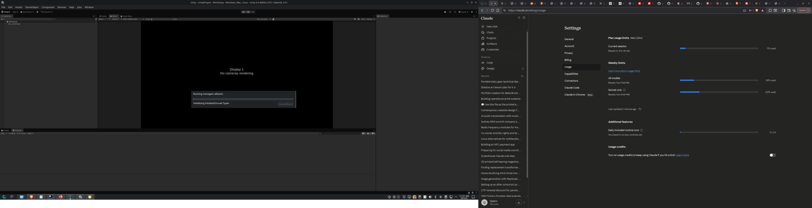

# What USB-C? — Desktop (Linux)

The desktop companion to the Android app. On Linux the USB Type-C connector
class (`/sys/class/typec/`) is **world-readable**, so — unlike on a phone — this
app can read the **actual cable eMarker** (the cable's electronic identity) when
the port exposes a Type-C Port Manager and an eMarked cable is attached.



## What it shows

- **Type-C port state** — power/data role, PD mode, orientation, PD revision.
- **Cable eMarker (read from the chip!)** — when an eMarked cable (5 A / USB4 /
  Thunderbolt / active) is plugged into a real Type-C port:
  vendor, construction (passive/active), data speed and charging rating, decoded
  straight from the cable's VDOs.
- **Connected USB devices + negotiated link speed** — the data-side truth that
  works on *any* machine: a device enumerated at 5 Gbps proves the cable to it is
  a SuperSpeed cable. Works even with no Type-C PD controller.
- **Guided notes** — honest explanations when PD/eMarker data isn't exposed
  (common on desktop towers whose USB-C ports wire straight to the chipset).

## Run

```bash
cd desktop
./whatusbc.py          # GTK GUI (auto-refreshes every 2s)
./whatusbc.py --cli    # terminal output
```

Requirements: Python 3, PyGObject (GTK 3). On Arch/CachyOS:
`sudo pacman -S python-gobject gtk3`

## Why the desktop can do what the phone can't

| | Phone (Android) | Linux desktop/laptop |
|---|---|---|
| `/sys/class/typec/` readable | ❌ SELinux-blocked | ✅ world-readable |
| Reads cable eMarker | only with root (rare) | ✅ yes, when port has TCPM |
| Reads negotiated PD | only with root | ✅ yes |
| USB device link speed | host-mode only | ✅ always |

A desktop/laptop is often the USB **host/source**, and Linux exposes the full
Type-C state to userspace, so reading the cable identity is straightforward —
no root, no Shizuku.

## Notes / limitations

- Desktop **tower** USB-C ports frequently don't expose a Type-C Port Manager
  (no `/sys/class/typec/portN`), so eMarker reads aren't available there — the
  app falls back to USB device enumeration + guidance. Laptops and machines with
  USB4/Thunderbolt controllers generally do expose it.
- Passive ≤3 A cables have no eMarker to read (physics) — the device link speed
  is the way to characterise them.

## Files

```
desktop/
├── whatusbc.py            launcher (GUI default, --cli for terminal)
└── whatusbc/
    ├── engine.py          sysfs + eMarker VDO decoder (kernel pd_vdo.h layout)
    ├── cli.py             colourised terminal report
    └── gui.py             GTK3 window
```
